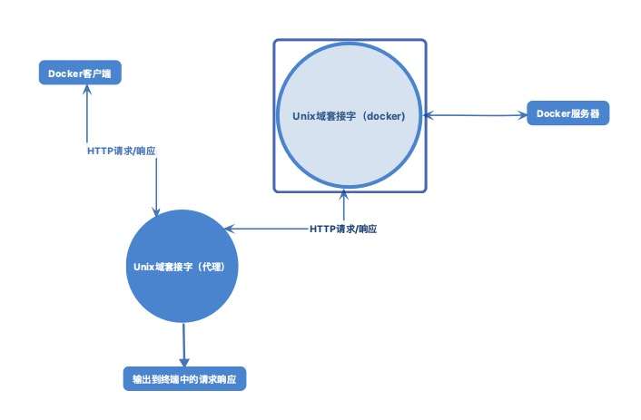

# Docker

### centos安装docker

内核版本(uname) 3.10及以上

yum install docker

systemctl start docker

## 常用操作

```shell
#搜索
docker search mysql
# docker 安装 
docker pull mysql:5.0.0
# 镜像列表
docker images
# 删除
docker rmi image-id
```


## docker 重启标志

| 策略                   | 功能                     |
| ---------------------- | ------------------------ |
| no                     | 容器退出时不重启（默认） |
| always                 | 容器退出时总是重启       |
| no-failure[:max-retry] | 只是失败时重启           |

```shell
# 
docker run -d --restart=always ubuntu echo done
docker run -d --restart=on-failure:10 ubuntu /bin/false

```

##  将Docker移动到不同分区

```shell
docker daemon -g /home/docker/example
```

如果想让这个移动永久生效，需要对宿主机系统的启动进程进行相应配置

## dockerfile

dockerfile是一个包含一系列命令的文本文件。

```dockerfile
#定义基础镜像
from node 
# 声明维护人员
maintainer xxx@gmail.com
# 克隆代码
run git clone -q https://github.com/docker-in-practice/todo.git
# 移动到代码目录
workdir todo
# 运行node包管理器的安装命令
run npm install > /dev/null
# 指定从所构建的镜像启动的容器需要监听这个端口
expose 8000
# 指定在启动时需要运行的命令
cmd ["npm","start"]

# docker build dirpath 构建镜像
```


## 如何开放Docker服务器给其他人访问

使用开放的TCP地址启动Docker守护进程

```shell
# 在开放之前需要停止实例.
suod service docker stop
# 如果报错 尝试下面命令
systemctl stop docker
# 检查进程是否还在
ps -ef | grep -E 'docker (-d|daemon) \b' | grep -v grep

# 使用tcp地址启动
docker daemon -H tcp://0.0.0.0:2375
# 外部连接命令
docker -H tcp://宿主ip:2375
```

> 如果开放了守护进程，请务必只向特定ip范围开放，同时不要绑定到0.0.0.0上，这样非常不安全！

## commint

```shell
# 语法
#docker commit [选项] <容器id或容器名> [<仓库名>:[:<标签>]]
# 下面示例为修改nginx欢迎页并提交为新的镜像
docker run --name webserver -d -p 80:80 nginx
docker exec -it webserver bash
echo '<h1>hello docker</h1>' > /usr/share/nginx/html/index.html
exit
# 查看命令修改后镜像的具体改动
docker diff web server 
docker commit --author author --message message webserver nginx:v2


```

> 慎用docker commit 
>
> 不要使用docker commit定制镜像，使用docker commit意味所有对镜像的操作都是黑箱操作。怎么生成的镜像别人无从得知。

### 使用dockerfile 定制镜像


```
# 指定某个镜像为基础。FROM scratch 表示为空白的镜像
FROM nginx 
RUN echo '<h1>Hello Docker!</h1>' > /usr/share/nginx/html/index.html
```

#### RUN命令

Dockerfile中的每一个指令都会建立一层，RUN也不例外。每一个RUN都会建立一层镜像。所以应避免多个RUN语句。并且每一层的东西并不会在下一层被删除，会一直跟随和镜像。因此构建镜像时，确保每一层只添加真正需要的东西，任何无关的东西都应该清理掉。

```dockerfile
FROM debian:jessie
RUN buildDeps='gcc libc6-dev make' \
    && apt-get update \
    && apt-get install -y $buildDeps \
    && wget -O redis.tar.gz "http://download.redis.io/releases/redis-3.2.5.tar.gz" \
    && mkdir -p /usr/src/redis \
    && tar -xzf redis.tar.gz -C /usr/src/redis --strip-components=1 \
    && make -C /usr/src/redis \
    && make -C /usr/src/redis install \
    && rm -rf /var/lib/apt/lists/* \
    && rm redis.tar.gz \
    && rm -r /usr/src/redis \
    && apt-get purge -y --auto-remove $buildDeps
```

#### 构建镜像 docker build

```shell
# docker build [选项] <上下文路径、URL>
$ docker build -t nginx:v1 .
Step 1/2 : FROM nginx
 ---> 568c4670fa80
Step 2/2 : RUN echo '<h1> hello docker</h1>' > /usr/share/nginx/html/index.html
 ---> Running in 31eab5e5e934
Removing intermediate container 31eab5e5e934
 ---> d46a0ea8029e
Successfully built d46a0ea8029e
Successfully tagged nginx:v1
```

docker build 命令最后的 '.' ,指的是上下文路径。`docker build` 命令会将路径下的所有内容打包，上传给Docker引擎。一般来说会将Dockerfile至于一个空目录下。如果目录下有文件不希望传给引擎，那么可以写一个 `.dockerignore` 文件忽略掉。

Dockerfile的文件名并不是必须的。可以使用`-f ../filename` 来指定某个文件作为Dockerfile。一般还是会使用默认名。

#### 其他docker build的用法

- git repo进行构建

  ```shell
  # docker会自动clone这个项目，切换到master分支。进入指定目录（/test/）开始构建
  docker build https://github.com/wangzhenguang/Dockerfile.git#:test
  ```


- tar压缩包构建

  ```
  docker build http://server/context.tar.gz
  ```

- 从标准输入流中读取进行构建

  ```shell
  # 直接从标准输入中读入内容，没有上下文。不可以做本地文件COPY进镜像之类的事情。
  docker build - < file
  cat file | docker build -
  # 如果是gzip bzip2 xz 等格式。会将其展开，将里面视为上下文构建。
  docker build - < context.tar.gz
  ```


### Dockerfile指令

#### COPY

格式

- COPY [--chown=<user>:<group>] <源路径>... <目标路径>

COPY指令将从构建上下文目录中 源路径的文件/目录复制到新的一层镜像内的 目标路径 位置

```dockerfile
COPY package.json /usr/src/app
COPY hom* /mydir/
COPY hom?.txt /mydir/
# 改变文件所属用户及组
COPY --chown=55:mygroup files* /mydir/

```


#### CMD命令

格式：

- shell : CMD <命令>
- exec : CMD ["可执行文件",""参数1","参数2"]

指令格式上一版推荐使用 exec格式，这类格式在解析是会被解析为JSON数组，因此一定要使用双引号。

如果使用shell格式，实际命令会被包装为sh -c 的参数进行执行。比如：

```shell
CMD echo $HOME
# 实际替换为
CMD echo ["sh","-c","echo $HOME"]
```

容器中前台执行和后台执行的问题

docker不是虚拟机，容器中的应用都应该以前台执行。没有后台服务的概念

#### ENERYPOINT

ENERYPOINT的格式和RUN格式一样。分为exec和shell。都是指定容器启动程序及参数。

ENTRYPOINT在运行时也可以替代，需要通过docker run 的参数 —entrypoint来指定。当指定后CMD的含义不再是直接运行云岭，而是当做参数传给ENTRYPOINT指令。 `<ENTRYPOINT> "<CMD>"`

- 场景一

  ```dockerfile
  FROM ubuntu:18.04
  RUN apt-get update \
      && apt-get install -y curl \
      && rm -rf /var/lib/apt/lists/*
  ENTRYPOINT [ "curl", "-s", "https://ip.cn" ]
  ```

  使用

  ```shell
  # -i 作为新的cmd，作为参数传给curl
  $ docker run myip -i
  ```

- 场景二

  启动主进程前的准备工作。

  比如mysql数据库。可能需要配置、初始化工作时。避免使用root用户启动服务。而启动前还需要以root身份执行一些必要工作。最终切换到服务用户身份启动服务。

#### ENV

格式：

 - ENV <key> <value>
 - ENV <key1>=<value1> <key2>=<value2>...

```dockerfile
ENV NODE_VERSION 7.2.0
RUN curl -SLO "https://nodejs.org/dist/v$NODE_VERSION/node-v$NODE_VERSION-linux-x64.tar.xz"
```


#### VOLUME 

格式：

- VOLUME ["<路径1>","<路径2>"...]
- VOLUME <路径>

容器运行时应该尽量保持容器存储层不会发生写操作，对于数据类需要保存动态数据的应用。其数据文件应该保存于卷中，为了防止用户忘记将动态文件保存于卷中的。在Dockerfile中，可以事先指定某些目录加载为匿名卷。

```shell
# 这里 /data目录在运行时自动挂载为匿名卷，任何向/data中写入的信息都不会记录进容器储存层。从而保证了容器存储层的无状态话。
VOLUME /data
# 运行时可以覆盖这个挂载
docker run -d -v mydata:/data path
```


#### EXPOSE 

格式：EXPOSE  端口1 [端口2....]

EXPOSE指令是声明运行时容器提供服务端口，在运行时并不会因为这个声明就会开启这个端口。

在运行时随机端口映射时，会自动随机映射EXPOSE端口.

#### WORKDIR 

格式： WORKDIR <工作目录>

使用WORKDIR指令可以指定工作目录。以后各层的当前目录就被改为指定的目录。如果不存在自动建立目录。

#### USER

格式：USER <用户名>[:<用户组>]

USER指令和WORKDIR相似，都是改变环境状态并影响以后的层。WORKDIR是改变工作目录。USER则是改变之后层的执行RUN 、CMD、以及ENTRYPOINT这类命令的身份。

用户必须事先建立好，否则无法切换

```dockerfile
RUN groupadd -r redis && useradd -r -g redis redis
USER redis
RUN ["redis-server"]
```

如果以root执行脚本，在执行期间希望改变身份。

```
# 建立redis用户 
RUN groupadd -r redis && useradd -r -g redis redis
# su 或者sudo 在一些环境下会出错 使用gosu 替代
RUN wget -O /usr/local/bin/gosu "https://github.com/tianon/gosu/releases/download/1.7/gosu-amd64" \
    && chmod +x /usr/local/bin/gosu \
    && gosu nobody true
 # 设置CMD ,并以其他用户执行
 CMD ["exec","gosu","redis","redis-server"]
```


#### HEALTHCHECK

格式：

 - HEALTHCHECK [选项] CMD <命令> : 设置容器健康状况命令
 - HEALTHCHECK NONE : 如果基础镜像有健康检查指令，使用这行可以屏蔽掉其健康检查指令。

HEALTHCHECK 支持下列选项

 -  --interval=<间隔> ：两次健康检查的间隔，默认30秒
 -  --timeout=<时长> :健康检查命令运行超过时间，如果超过视为失败。
 -  --retries=<次数> : 当连续失败指定次数后，则将容器视为unhealthy。 默认3次

```dockerfile
FROM nginx
RUN apt-get update && apt-get install -y curl && rm -rf /var/lib/apt/lists/*
HEALTHCHECK --interval=5s --timeout=3s CMD curl -fs http://localhost/ || exit 1
```


## 容器操作

```shell
# 运行容器
#--name 自定义容器名 -d:后台运行 image-name:指定镜像
docker run --name container-name -d image-name
# 查看运行中的容器 -a 查看所有
docker ps 
#停止 
docker stop container-name/container-id
# 启动容器
docker run container-id
# 启动一个bash终端，-t 分配一个伪终端并绑定到容器的标准输入上。-i 则让容器的标准输入保持打开。
docker run -t -i ubuntu:14.04 /bin/bash
#删除
docker rm container-id
# 端口映射
docker run -d -p 8888:8080 --name tomcat
# 容器日志
docker logs container-name/container-id
# -i 表示赋予容器与Telnet会话交互的能力。
# -p 端口映射
# --name 赋予容器一个名字
# nc 在1234端口上运行一个简单的监听服务器。
docker run -d -i -p 1234:1234 --name daemon ubuntu nc -l 1234
# 终止容器
docker container stop
docker container restart
# 进入容器
docker attach container_id
# -i 参数时，没有分配伪终端 推荐这种进入容器
docker exec -i container_id bash
docker exec -it container_id bash


```

### 导入导出容器

```
# 导出容器快照
docker export containter_id > ubuntu.tar
# 导入
cat ubuntu.tar | docker import - test/ubuntu:v1.0
# 可以通过url来导入
docker import http://example.com/exampleimage.tgz example/imagerepo
```

> 用户既可以使用docker load 来导入镜像存储文件到本地镜像库，可以使用docker import 来导入一个容器快照到本地镜像库。这两者的区别在于容器快照文件将丢弃所有的历史记录和元数据信息（即保存容器当时的快照状态），而镜像存储文件将保存完整记录，体积也要大。容器快照文件导入时可以重新制定标签等元数据信息。

### 删除容器

```
docker container rm  xx
# 清理所有终止容器
docker container prune
```


## Docker客户端

### 监控docker api流量

```shell
# socat 是一个强大命令，能让用户在两个几乎任意类型的数据通道之间中继数据。如果熟悉netcat，可以将其看做是加强版的netcat。

# -v用于提高输出的可读性，带有数据流的指示。
# UNIX-LISTEN socat 在一个Unix套接字上进行监听
# UNIX-CONNECT是让socat连接到Docker的Unix套接字。
# & 后台运行该命令
sudo socat -v UNIX-LISTEN:/tmp/dockerapi.sock UNIX-CONNECT:/var/run/docker.sock &
```




### 连接容器实现端口隔离

```shell
docker run --name wp-mysql -e MYSQL_ROOT_PASSWORD=PASSWORD -d mysql 
# 将wp-mysql容器连接到wordpress容器中 wordpress容器中对mysql的引用将会发送到wp-mysql中
docker run --name wordpress --link wp-mysql:mysql -p 10003:80 -d wordpress

```


> 链接可以让用户封装并定义容器间的关系，而无需将服务暴露给宿主机网络。

### docker 注册中心

在本地建立一个注册中心服务器

```shell
# 运行docker宿主机的5000端口上，并使用registry作为容器的/var/lib/registry目录，后者是容器里的registry 
#默认储存文件的位置，同时指定容器内的registry将文件储存在/registry目录下。
docker run -d -p 5000:5000 -v $HOME/registry:/var/lib/registry registry:2
# 在所有想要访问这个注册中心的机器上，将下列内容添加到守护进程选项中
--insecure-registry HOSTNAME
# 上传镜像
docker push hostname:5000/image:tag
```


## 仓库

### 安装docker-registry

```
# 使用官方的registry 进项来启动私有仓库。 默认仓库会在容器的/var/lib/registry目录下。 
docker run -d -p 5000:5000 --restart=always --name registry registry
# 通过-v 来讲镜像文件存放在本地的指定路径
docker run -d -p 5000:5000 -v /var/lib/local/registry:/var/lib/registry registry
```


### 使用私有仓库

```
# 标记要上传的镜像
docker tag ubuntu:latest 127.0.0.1:5000/ubuntu:latest

# 上传
docker push 127.0.0.1:5000/ubuntu:latest
# curl查看仓库
curl 127.0.0.1:5000/v2/_catalog

# 从私有仓库拉取镜像
docker pull 127.0.0.1:5000/ubuntu:latest

```

取消https限制

- Ubuntu 14.04 ,Debian7

  ```
  vi /etc/default/docker
  # 添加
  DOCKER_OPTS="--registry-mirror=https://registry.docker-cn.com --insecure-registries=192.168.199.100:5000"
  # 重启服务
  service docker restart
  ```

- #### Ubuntu 16.04+, Debian 8+, centos 7

  ```
  vi /etc/docker/daemon.json
  # 添加
  {  "insecure-registries": [
      "192.168.199.100:5000"
    ]}
    #最后重启服务
  ```

- mac

  preferences ->Daemon -> Advanced

  ```
  #添加
  {  "insecure-registries": [
      "192.168.199.100:5000"
    ]}
    # 最后 Apply&Restart
  ```
## 数据管理

### 数据卷

数据卷是一个可供一个或多个容器使用的特殊目录，绕过ufs。提供以下特性

- 可以在容器之间共享和重用
- 对数据卷的修改会立马生效
- 对数据卷的更新，不会影响镜像
- 数据卷默认会一直存在，即使容器被删除

```shell
# 创建数据卷
docker volume create my-vol
# 查看所有的数据卷
docker volume ls
# 查看指定卷里的信息
docker volume inspect my-vol
# 启动一个挂在数据卷的容器. 在一次docker run中可以挂在多个数据卷
docker run -d -P --name web --mount source=my-vol,target=/webapp \
training/webapp python app.py
# 查看数据卷的具体信息
docker inspect web
# 删除数据卷
docker volume rm my-vol
```

挂载主机目录

```shell
# 挂载一个主机目录作为数据卷
# 将/src/webapp目录挂载到 /opt/webapp目录 --mount不会自动创建目录,可以通过增加readonly指定为只读
docker run -d -P --name web \
--mount type=bind,source=/src/webapp/,target=/opt/webaap,readonly \ 
tranining/webapp python app.py

# 挂载一个本机主机文件作为数据卷
docer run --rm -it \ --mont type=bind,source=$HOME/.bash_history,target=/root/.bash_history \
ubuntu:18.04 \ bash
```


## 网络

配置端口

```shell
# -P 随机应设一个（49000-49900）到内部容器开放的网络端口
# -p hostPort:containerPort 可以使用多次来绑定多个端口
docker run --name webserver -d -p 80:80 nginx
# udp端口指定
docker run -d -p 5000:5000/udp training/webapp python app.py
#查看映射端口配置 
docker port nostalgic_morse 80
```


## Docker Compose

[二进制包安装方式](https://github.com/docker/compose/releases)

pip安装

```shell
# 安装
sudo pip install -U docker-compose
# bash不全命令 不是很懂。。todo
curl -L https://raw.githubusercontent.com/docker/compose/1.8.0/contrib/completion/bash/docker-compose > /etc/bash_completion.d/docker-compose

```

容器中直接运行

```
curl -L https://github.com/docker/compose/releases/download/1.8.0/run.sh > /usr/local/bin/docker-compose
chmod +x /usr/local/bin/docker-compose
```

卸载

```
sudo rm /usr/local/bin/docker-compose
sudo pip uninstall docker-compose
```

