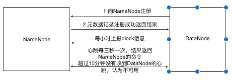

#  Hadoop

## 搭建集群

步骤：

 - 配置节点ssh免密登录 配置jdk

 - 配置 core-site.xml hdfs-site.xml mapred-site.xml yarn-site.xml

   ```xml
   <configuration>
       <!--core-site.xml配置-->
   	<property>
   	    <!-- 指定hadoop所使用的文件系统 namenode地址-->
   	    <name>fs.defaultFS</name>
   	    <value>hdfs://hadoop-master:9000</value>
       </property>
   	    <!--指定hadoop运行时产生文件的存储目录-->
       <property>
   	    <name>hadoop.tmp.dir</name>
   	    <value>/usr/local/hadoop/tmp</value>
   	</property>
       
        <!--hdfs-site.xml配置-->
        <property>
             <name>dfs.replication</name>
             <value>2</value>
        </property>
        <property>
           <name>dfs.namenode.secondary.http-address</name>
           <value>hadoop-slave1:50090</value>
        </property>
       
        <!--mapred-site.xml配置-->
        <property>
           <name>mapreduce.framework.name</name>
           <value>yarn</value>
       </property>
       
        <!--yarn-site.xml配置-->
   	<property>
           <name>yarn.resourcemanager.hostname</name>
           <value>hadoop-master</value>
       </property>
       <property>
           <name>yarn.nodemanager.aux-services</name>
           <value>mapreduce_shuffle</value>
       </property>
   </configuration>
   ```

 - 配置slaves

 - 格式化namenode hdfs namenode -format

启动/停止

start-dfs.sh start-yarn.sh

测试集群

```shell
# 上传文件到hdfs
hadoop fs -mkdir -p /test/
hadoop fs -put test.file /test
hadoop fs -lsr /test/
```

同步集群时间

```shell
# master 节点配置
# 检查ntp是否安装
rpm -qa | grep ntp
# 修改配置文件
vi /etc/ntp.conf
# 开启 restrict 192.168.1.0 mask 255.255.255.0
# 注释默认时间服务器
# server 0(1/2/3).centos.pool.ntp.org iburst
# 添加自己的时间服务器
# server 127.127.1.0
# fudge 127.127.1.0 stratum 10

# 修改ntpd文件
vi /etc/sysconfig/ntpd
# 添加内容 让硬件时间与系统时间一起同步
SYNC HWCLOCL=yes

# 重启ntpd
service ntpd start
chkconfig ntpd on

# slave节点配置定时任务获取时间
crontab -e 
*/1 * * * * /usr/sbin/ntpdate hadoop-master

```

### 编译hadoop源码

1. 安装jdk 配置jdk环境

2. 配置maven_home

3. 配置ANT_HOME

4. 安装glibc-headers 、g++ 、make、cmake

   ```shell
   yum install glibc-headers
   yum install gcc-c++
   yum install make
   yum install cmake
   ```

5. 配置编译protobuf

   ```wiki
   进入protobuf目录，执行 .configure && make && make check && make install && ldconfig
   配置环境变量
   export LD_LIBRARY_PATH=/protobuf_path
   export PATH=$PATH:$LD_LIBRARY_PATH
   验证 protoc --version
   
   ```

6. 安装openssl yum install openssl-devel

7. 安装ncurses-devel yum install ncurses-devel

8. mvn package -Pdist,native -DskipTests -Dtar

9. hadoop编译后的包在hadoop-dist/target下

## HDFS

不适合低延迟的数据访问

无法高效的对大量小文件进行存储

保持一致性，无法多个线程同时写文件

不支持文件随机修改

### 常用配置

配置文件优先级

代码-> 项目路径配置文件 -> 默认 

```xml
<configuration>
         <!--副本数量-->
	<property>
    	<name>dfs.replication</name>
        <value>3</value>
    </property>
     <!--second namenode 位置 默认namenode同一个位置-->
    <property>
    	<name>dfs.namenode.secondary.http-address</name>
        <value>hostname:50090</value>
    </property>
</configuration>
```

### 常用命令行操作

```
hadoop fs -ls /
hadoop fs -cat file
hadoop fs -put file /
fs -moveFromLocal #本地拷贝到hdfs
fs -moveToLocal #hdfs到本地
fs -appendToFile # 追加一个文件到文件末尾
fs -copyToLocal
fs -getmerge #合并文件

# 反序列化
hdfs oev -p XML -i edits_inprogress_xx -o edits.xml
# 滚动日志
hdfs dfsadmin -rollEdits

```

### 客户端操作代码示例

将hadoop中share目中的jar到项目中

配置hadoop_home

```java
//操作代码部分示例
public class HdfsTest {

    FileSystem fs = null;
    Configuration conf = null;

    @Before
    public void before() throws IOException {
        conf = new Configuration();
        conf.set("fs.defaultFS", "hdfs://hadoop-master:9000");
        fs = FileSystem.get(conf);
    }

    @Test
    public void testUpload() throws IOException {
        fs.copyFromLocalFile(new Path("查询的数据.txt"), new Path("/test/查询的数据.txt"));
        fs.close();
        fs.copyFromLocalFile(new Path("flow.log"), new Path("/mr_test/flow.log"));
        fs.close();
    }
    @Test
    public void testUplodByStream() throws Exception {
        FileInputStream fis = new FileInputStream(new File("查询的数据.txt"));
        FSDataOutputStream fos = fs.create(new Path("/test/查询的数据.txt"));

        IOUtils.copyBytes(fis, fos, conf);

        IOUtils.closeStream(fis);
        IOUtils.closeStream(fos);
    }

    @Test
    public void testDownload() throws IOException {
        fs.copyToLocalFile(new Path("/test/查询的数据.txt"), new Path("查洵的数据.txt.hdfs"));
        fs.close();
    }

    @Test
    public void testConf() {
        Iterator<Map.Entry<String, String>> iterator = conf.iterator();
        while (iterator.hasNext()) {
            Map.Entry<String, String> next = iterator.next();
            System.out.println(next.getKey() + ": " + next.getValue());
        }
    }

    @Test
    public void makdirTest() throws Exception {
        boolean mkdirs = fs.mkdirs(new Path("/aaa/bbb"));
        System.out.println(mkdirs);
    }

    /**
     * 删除
     */
    @Test
    public void deleteTest() throws Exception{
        boolean delete = fs.delete(new Path("/mr_test"), true);//true， 递归删除
        System.out.println(delete);
    }

    @Test
    public void listTest() throws Exception{
        FileStatus[] listStatus = fs.listStatus(new Path("/"));
        for (FileStatus fileStatus : listStatus) {
            System.err.println(fileStatus.getPath()+"================="+fileStatus.toString());
        }
        //会递归找到所有的文件
        RemoteIterator<LocatedFileStatus> listFiles = fs.listFiles(new Path("/"), true);
        while(listFiles.hasNext()){
            LocatedFileStatus next = listFiles.next();
            String name = next.getPath().getName();
            Path path = next.getPath();
            System.out.println(name + "---" + path.toString());
        }
    }


}

```


### hdfs写数据流程


### NameNode机制

1. namenode启动时加载edits和fsimage到内存中。

2. client请求修改数据，会先记录操作到日志中 edits.inprogress

3. secondary namenode检查是否需要checkpoint

   触发条件：时间1小时 edits记录超过100万条

4. 执行checkpoint，namenode将原有的edits.inprogress重名名。新建一个新的edits.inprogress

5. 将edits文件和fsimage拷贝到secondary namenode并加载到内存中进行合并

6. 返回合并后的fsimage.chkpoint到namenode中

7. namenode重命名fsimage.chkpoint为fsimage。


```xml
<!--checkpoint触发条件修改-->
<configuration>
	<property>
    	<name>dfs.namenode.checkpoint.txns</name>
        <value>1000000</value>
        <description>edits操作次数</description>
    </property>
    <property>
    	<name>dfs.namenode.checkpoint.period</name>
        <value>3600</value>
        <description>checkpoint间隔时间</description>
    </property>
    <property>
    	<name>dfs.namenode.checkpoint.checkperiod</name>
        <value>60</value>
          <description>操作次数检查间隔</description>
    </property>
</configuration>

```


> edits记录的操作日志。fsimage存储最终的结果。

### NameNode故障处理

1. 手动拷贝SecondaryNameNode数据

2. 使用-importCheckpoint启动namenode

   1. 修改配置

   ```xml
   <!--修改配置-->
   <configuration>
   	<property>
       	<name>dfs.namenode.checkpoint.period</name>
           <value>120</value>
       </property>
       <property>
       	<name>dfs.namenode.name.dir</name>
           <value>name dir</value>
       </property>
   </configuration>		
   ```

   2. kill -9 namenode
   3. 删除原有namenode数据
   4. 将secondaryNameNode数据拷贝到NameNode同一级目录下，并删除in_use.lock
   5. 执行命令  bin/hdfs namenode -importCheckpoint
   6. 启动namenode hadoop-daemon.sh start namenode

### NameNode多目录配置

1. 配置

```xml
<configuration>
    <property>
    	<name>dfs.namenode.name.dir</name>
        <value>file:///dirpath1,file://dirpath2</value>
    </property>
</configuration>
```

2. 停止集群，删除logs、data数据
3. 格式化namenode
4. 重新启动

### DataNode机制



###  DataNode超时配置

超时时间 = 2 * dfs.namenode.heartbeat.recheck-interval + 10 * dfs.heartbeat.interval

```xml
<configuration>
	<property>
    	<name>dfs.namenode.heartbeat.recheck-interval</name>
        <value>300000</value>
        <description>毫秒</descrpition>
    </property>
    <property>
    	<name>dfs.heartbeat.interval</name>
        <value>3</value>
         <description>秒</descrpition>
    </property>
</configuration>
```

### DataNode多目录配置

hdfs-site.xml

```xml
<property>
	<name>dfs.datanode.data.dir</name>
    <value>file:///${hadoop.tmp.dir}/dfs/dir1,file:///${hadoop.tmp.dir}/dfs/dir2</value>
</property>
```

### DataNode新增节点

1. 在NameNode的机器上配置hdfs-site.xml，添加dfs.hosts文件。文件中写入所有的主机名。

   ```xml
   <property>
   	<name>dfs.hosts</name>
       <value>dfs.hosts.file</value>
   </property>
   ```

2. 刷新NameNode、ResourceManager

3. slaves中增加新增的DataNode Host

4. 单独启动服役的DataNode 

### DataNode退役配置

1. 新建dfs.hosts.exclude文件，添加需要配置的主机名字

2. 在hdfs-site.xml中添加如下配置

   ```xml
   <property>
   	<name>dfs.hosts.exclude</name>
       <value>dfs.hosts.exclude file path</value>
   </property>
   
   ```

3. 刷新NameNode、ResourceManager

   ```shell
   hdfs dfsadmin -refreshNodes
   yarn rmadmin -refreshNodes
   ```

4. 等待DataNode复制完成（状态为decommissioned）。需注意服役的节点，必须>=副本数量。

5. 删除hdfs-site.xml中dfs.hosts节点值的文件中的DataNode host。 重新刷新NameNode ResourceManager

6. 从slave中去掉退役的DataNode Host

7. 如果数据不均衡可以执行 sbin/start-balancer.sh

### 优化小文件

- 将多个小文件打包成一个har文件，当做一个整体。减少namenode的内存使用

```shell
#归档钱需要启动yarn
hadoop archive -archiveName test.har -p /test /testhar
# 查看归档
hadoop fs -lsr /testhar/test.har
hadoop fs -lsr har:///test.har
# 解归档文件
hadoop fs -cp har:///test.har/test.file /
```

- Sequence file

  sequence file由二进制文件组成，key为文件名，value为文件内容。则可以将大批小文件合并成一个大文件。

- CombineFileInputFormat

  将多个文件合并成一个单独的split，另外它会考虑存储位置

- 开启JVM重用

### 集群间的数据拷贝

在没有ssh的方式下可以使用discp

```
bin/hadoop discp hdfs://hadoop-master:9000/test.txt hdfs://hadoop-slave1:9000/test.txt
```


## mapreduce

- MapReduce不适合做实时计算、流式计算、DAG（有向图）计算。

### 历史服务配置

mr-jobhistory-daemon.sh start historyserver

```xml
    <!--历史服务配置-->
    <property>
    	<name>mapreduce.jobhistory.address</name>
        <value>hostname:10020</value>
    </property>
    <property>
    	<name>mapreduce.jobhistory.webapp.address</name>
        <value>hostname:19888</value>
    </property>	
```

### 压缩数据

#### 压缩方式比较

| 压缩格式 | 是否自带     | 文件拓展名 | 是否可切分 | 压缩后，原来程序是否需要修改 | 编码/解码器 |
| -------- | -------- | ------- | ---------- | -------- | ---------------------------- |
| DEFLATE  | 是     | .deflate   | 否       | 文本处理，不需要修改         | org.apache.hadoop.io.compress.DefaultCodec |
| GZIP     | 是      | .gz        | 否       | 文本处理，不需要修改         | org.apache.hadoop.io.compress.GzipCodec |
| BZIP     | 是        | .bz2 | 是 | 文本处理，不需要修改 | org.apache.hadoop.io.compress.BZip2Code |
| LZO | 否 | .lzo | 是 | 需要建索引，指定输入格式 | com.hadoop.compression.lzo.LzopCodec |
| SNAPPY | 否 | .snappy | 否 | 文本处理一样，不需要修改 | org.apache.hadoop.io.compress.SnappyCodec |

- GZip
  - 压缩率比较高，压缩解压速度也比较快，hadoop本身支持，linux自带Gzip命令。
  - 不支持切分
  - 适用于压缩后文件小于128M
- Bzip
  - 支持切分，具有很高的压缩率(大于gzip) ,本身自带
  - 压缩解压速度慢
  - 适合对速度要求不高，但需要压缩率高的情况
  - 输出数据大，需要压缩存档并且以后使用较少的情况
- lzo
  - 压缩解压速度较快，支持切分。
  - 压缩率比GZip要低，本身不支持，需要安装，需要对lzo格式做特殊处理。需要建索引
  - 应用场景：压缩后文件大于200以上的可以考虑，单个文件越大，lzo优点越明显
- snappy
  - 高速压缩和合理的压缩率
  - 不支持split，压缩率比gzip低。本身不支持需要安装。
  - 场景：当MapReduce作业的Map输出的数据比较大的时候，作为Map到Reduce的中间数据的压缩格式，或者作为一个MR到两一个MR的输入

#### 压缩配置

| 参数                                                         | 默认值                                                       | 阶段           | 建议                                     |
| ------------------------------------------------------------ | ------------------------------------------------------------ | -------------- | ---------------------------------------- |
| io.compression.codecs (core-site.xml)                        | org.apache.hadoop.io.compress.DefaultCodec,<br />org.apache.hadoop.io.compress.GzipCodec,<br />org.apache.hadoop.io.compress.BZip2Codec | 输入压缩       | hadoop会根据后缀自动判断是否支持编码     |
| mapreduce.map.output.compress(mapred-site.xml)               | false                                                        | mapper输出阶段 |                                          |
| mapreduce.map.output.compress.codec(mapred-site.xml)         | org.apache.hadoop.io.compress.DefaultCodec<br />（org.apache.hadoop.io.compress.SnappyCodec） | mapper输出阶段 | 这阶段一般使用LZO、Snappy编码器          |
| mapreduce.output.fileoutputformat.compress(mapred-site.xml)  | false                                                        | reducer输出    |                                          |
| mapreduce.output.fileoutputformat.compress.codec(mapred-site.xml) | org.apache.hadoop.io.compress.DefaultCodec                   | reducer输出    | 使用标准工具或gzip、bzip2                |
| mapreduce.output.fileoutputformat.compress.type              | RECORD                                                       | reducer输出    | sequenceFile输出使用的压缩类型：NODE、BL |

#### 压缩代码示例

MapReduce有3个阶段可以压缩

- map输入阶段 (此阶段根据后缀名自动匹配编码器)
- map输出阶段
- reduce输出阶段

```java
   		Configuration configuration = new Configuration();
        //开启map端输出压缩
        configuration.setBoolean("mapreduce.map.output.compress", true);
        // 设置map端输出压缩方式
        configuration.setClass("mapreduce.map.output.compress.codec", BZip2Codec.class, CompressionCodec.class);
   		//设置reduce输出阶段压缩
        FileOutputFormat.setCompressOutput(job, true);
        //设置压缩方式
        FileOutputFormat.setOutputCompressorClass(job, BZip2Codec.class);
        FileOutputFormat.setOutputCompressorClass(job, GzipCodec.class);
        FileOutputFormat.setOutputCompressorClass(job, DefaultCodec.class);


```


### MapReduce优化

- 数据输入

  - 合并小文件（小文件会增大map任务的装载次数），采用CombineTextInputFormat来作为数据，解决输入端大量小文件场景。

- Map阶段

  - 减少溢写次数，增大触发Spill的内存上限，减少Spill次数，从而减少IO。
  - 增大合并文件数目，减少Merge次数，从而缩短MR处理时间
  - 在不影响业务逻辑下，先进行Combine处理。

- Reduce阶段

  - 合理设置Map、Reduce数
  - 设置Map、Reduce共存,是map运行到一定程度后，Reduce也开始运行，减少等待时间
  - 规避使用Reduce
  - 合理设置Reduce端的Buffer

- I/O传输

  - 采用数据压缩方式
  - 使用SequenceFile二进制文件

- 数据倾斜（数据频率倾斜-某一区域数据量远远大于其他，数据大小倾斜-部分记录大小远远大于平均值）

  - 抽样和范围分区

    通过对原始数据进行抽样得到结果来预设分区边界值

  - 自定义分区

    基本数据背景（怎么获得的，渠道）来分析。进行自定义分区。

  - Combine 

  - 采用Map Join，尽量避免Reduce Join

- 常用调优参数

  mapred-site.xml

  | 配置参数                                      | 参数说明                                                     |
  | --------------------------------------------- | ------------------------------------------------------------ |
  | mapreduce.map.memory.mb                       | 一个MapTask可以使用的资源上限，默认为1024M，如果超过会强制杀死。 |
  | mapreduce.reduce.memory.mb                    | 一个ReduceTask可使用的资源上线默认1024M                      |
  | mapreduce.map.cpu.vcores                      | 每个MapTask可使用的最多cpu core数目，默认1                   |
  | mapreduce.reduce.shuffle.parallelcopies       | 每个Reduce去Map中取数据的并行数。默认5                       |
  | mapreduce.reduce.shuffle.merge.percent        | Buffer中的数据达到多大比例开始写入磁盘。默认0.66             |
  | mapreduce.reduce.shuffle.input.buffer.percent | buffer大小占Reduce可用内存的比例。默认0.7                    |
  | mpareduce.reduce.input.buffer.percent         | 指定多少比例的内存用来存放buffer中的数据。默认0.0            |
  | mapreduce.task.io.sort.mb                     | shuffle环形缓冲区大小，默认100M                              |
  | mapreduce.map.sort.spill.percent              | 环形缓冲区溢出的阈值，默认80%                                |
  | mapreduce.map.maxattempt                      | 每个Map Task最大重试次数。默认4                              |
  | mapreduce.reduce.maxattempts                  | 每个Reduce Task最大重试次数。默认4                           |
  | mapreduce.task.timeout                        | Task超时时间，默认600000毫秒。该参数过小常出现的错误提示是“AttemptID:attempt_14267829456721_123456_m_000224_0<br/>Timed out after 300 secsContainer killed by the ApplicationMaster. |

  yarn-site.xml

  | 参数                                     | 说明                                   |
  | ---------------------------------------- | -------------------------------------- |
  | yarn.scheduler.minimum-allocation-mb     | 给Container分配的最小内存，默认1024    |
  | yarn.scheduler.maximum-allocation-mb     | 给应用Container分配的最大内存，默认8G  |
  | yarn.scheduler.minimum-allocation-vcores | Container申请的最小cpu核数。默认1      |
  | yarn.scheduler.maximum-allocation-vcores | 每个Container申请的最大cpu合数。默认32 |
  | yarn.nodemanager.resource.memory-mb      | Container分配的最大物理内存。默认8G    |


## yarn

### 基本架构

| 组件              | 作用                                                         |
| ----------------- | ------------------------------------------------------------ |
| ResourceManage    | 处理客户端请求，监控NodeManager,启动或监控ApplicationMaster，资源分配与调度 |
| NodeManager       | 管理单个节点上的资源，处理来自ResourceManager、ApplicationMaster的命令 |
| ApplicationMaster | 负责数据的切分，申请资源并分配给内部任务，任务的监控与容错。 |
| Container         | YARN中的资源抽象，封装了某个节点的多维度资源（cpu、内存等）。 |


### 资源调度器

Hadoop调度器有三种：FIFO、Capacity Scheduler 、Fair Scheduler。

配置位置

```xml
<name>yarn.resourcemanager.scheduler.class</name>
```

- FIFO调度器

  按时间排序，先到先服务

- 容量调度器（Capacity Scheduler)

  支持多个队列，每个队列可配置一定的资源量，队列采用FIFO策略。

  调度器会对同一个用户提交的资源进行限定。

  job分配时，会计算队列正在运行的任务数与分得的计算资源比值，选择最小的一个（比如分别有50个任务和分得40% 和20个任务，30%资源    50/40> 20/30 ，选择后面的队列）

- 公平调度器（Fair Scheduler)

  多队列，每个队列的资源可以配置

  按照优先级分配资源，优先级越高分配资源越多，但是每个job都会分配到资源。

### 任务推测执行

配置位置

```XML
<!-- mapred-site.xml 默认是true -->
<name>mapreduce.map.speculative</name>
```

- 推测任务执行条件

  当前job已经完成的Task必须不小于5%，配置文件中开启了推测执行。（每个Task只会启动一个备份任务）

- 不能启动推测执行机制的情况

  任务间存在严重的负载倾斜

  特殊任务（任务向数据库中写数据等）


### 日志聚集配置

```xml
<configuration>
     <!--resourcemanager 位置-->
 	<property>
            <name>yarn.resourcemanager.hostname</name>
            <value>hadoop-master</value>
    </property>
     <!--reducer获取数据的方式-->
    <property>
            <name>yarn.nodemanager.aux-services</name>
            <value>mapreduce_shuffle</value>
    </property>
    
    <!--开启日志聚集功能-->
	<property>
    	<name>yarn.log-aggregation-enable</name>
        <value>true</value>
    </property>
    <property>
    	<name>yarn.log-aggregation.retain-seconds</name>
        <value>604800</value>
    </property>
</configuration>
```


## 配置Snappy压缩

```shell
# 之前安装好hadoop编译的其他环境 mvn、jdk、ant、protobuf 等
# 编译安装 Snappy
tar -zxvf snappy-1.1.3
./configure
make && make install
# 编译hadoop支持snappy名ing
mvn clean package -DskipTests -Pdist,native -Dtar -Dsnappy.lib=/usr/local/lib -Dbundle.snappy

# 各个软件的版本
hadoop 2.8.5
protobuf 2.5.0
ant 1.9.13
jdk 1.8
mvn 3.10.0
snappy-1.1.3
```


