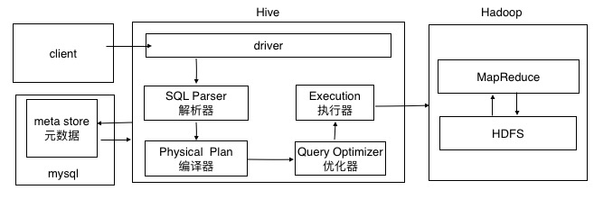
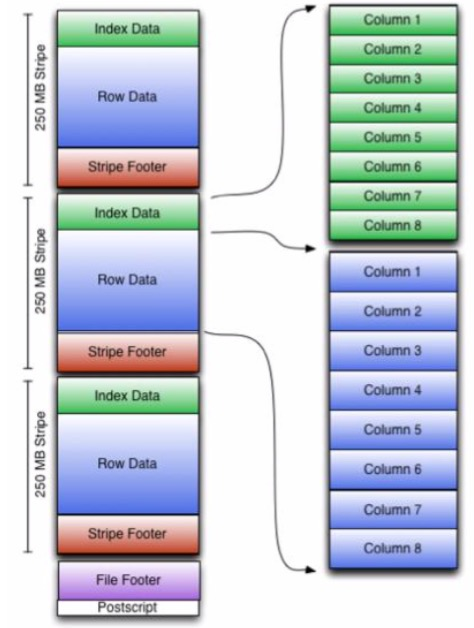

# HIVE

## 大致结构图



## 安装

- 解压hive安装包
- 配置./hive/conf/hive-env.sh
  - 增加HADOOP_HOME环境配置
  - 配置HIVE_CONF_DIR路径

启动 bin/hive

## 配置

### 参数配置的几种方式

- 默认配置文件 hive-default.xml ，用户自定义配置文件 hive-site.xml

- 命令行参数  `hive -hiveconf mapred.reduce.tasks=10` (本次有效)

- hive交互窗口设置  `set mapred.reduce.tasks=10`(本次有效)


### 配置mysql

```xml
<?xml version="1.0" encoding="UTF-8" standalone="no"?>
<?xml-stylesheet type="text/xsl" href="configuration.xsl"?>
<configuration>
        <property>
                <name>javax.jdo.option.ConnectionURL</name>
                <value>jdbc:mysql://hadoop02:3306/hivedb?createDatabaseIfNotExist=true</value>
        </property>
        <property>
                <name>javax.jdo.option.ConnectionDriverName</name>
                <value>com.mysql.jdbc.Driver</value>
        </property>
        <property>
                <name>javax.jdo.option.ConnectionUserName</name>
                <value>root</value>
        </property>
        <property>
                <name>javax.jdo.option.ConnectionPassword</name>
                <value>root</value>
        </property>
</configuration>

```

> 注意数据库的编码和驱动jar包用的默认编码
>
> ./schematool -initSchema -dbType mysql --verbose 初始化元数据

### 查询信息显示表头和数据库

```xml
  		<property>
                <name>hive.cli.print.header</name>
                <value>true</value>
        </property>
        <property>
                <name>hive.cli.print.current.db</name>
                <value>true</value>
        </property>
```


### log存放位置配置

```shell
vi conf/hive-log4j.properties
property.hive.log.dir = ${sys:java.io.tmpdir}/${sys:user.name}
```


## 基本操作

```shell
# 不进入hive的交互窗口执行sql
hive -e 'sql';
# 执行文件中的sql
hive -f filepath;
# hive窗口查看hdfs系统
dfs -ls /;
# 创建tmp表 \t作为分割符
create table tmp(id int,name string) row format delimited fields terminated by '\t';

# 导入本地数据
load data local inpath 'path' into table tablename;
```

### beeline连接

```shell
# 启动目标机器上的hive server
# nohup hive --service hiveserver2 &
# ps -ef | grep Hive
# 连接
./bin/beeline
!connect jdbc:hive2://ip:10000
#Error: Could not open client transport with JDBC Uri: jdbc:hive2://localhost:10000: Failed to open new session: java.lang.RuntimeException: org.apache.hadoop.ipc.RemoteException(org.apache.hadoop.security.authorize.AuthorizationException): User: root is not allowed to impersonate hadoop (state=08S01,code=0)
# 权限问题可在hdfs-site.xml中配置
      <property>
                <name>hadoop.proxyuser.root.hosts</name>
                <value>*</value>
        </property>
        <property>
                <name>hadoop.proxyuser.root.groups</name>
                <value>*</value>
        </property>

```


### DDL数据定义

#### 数据库操作

```shell
# 创建表
create database testdb;
create database testdb if not exists testdb;
# 执行数据库在hdfs上的存放位置
create database testdb location '/hive_db.db';
# 设置数据库的属性信息。
alter database testdb set dbproperties('field'='value');
# 查看数据库详细信息
desc database extended testdb;
#显示数据库
show databases;
#过滤显示查询数据库
show databases like 'test*';
# 显示数据库信息
desc database testdb;
# 删除空数据库
drop database testdb;
#强制删除数据库
drop database testdb cascade;

```

#### 表操作

```shell
# 建表
CREATE [EXTERNAL] TABLE [IF NOT EXISTS] table_name
[(col_name data_type [COMMENT col_comment], ...)]
[COMMENT table_comment]
[PARTITIONED BY (col_name data_type [COMMENT col_comment], ...)] [CLUSTERED BY (col_name, col_name, ...)
[SORTED BY (col_name [ASC|DESC], ...)] INTO num_buckets BUCKETS] [ROW FORMAT row_format]
[STORED AS file_format]
[LOCATION hdfs_path]
```

- EXTERNAL 关键字可以创建一张外部表，在建表的同时指定实际数据路径，
  - 内部表，会将数据移动到数据仓库指向的路径。删除时，数据和元数据都会一起删除。
  - 外部表 仅记录数据所在的路径，不对数据的位置做任何改变。删除时，只删除元数据，不删除数据
- comment : 表和列添加注释
- PARTITIONED BY: 创建分区表
- CLUSTERED BY ： 创建分桶表
- SORTED BY 排序
- ROW FORMAT 列分割符
- STORED AS : 指定存储文件类型 （SEQUENCEFILE 二进制文件、 TEXTFILE 文本、RCFILE 列式存储格式文件）
- LOCATION :指定表在HDFS上的存储位置

```shell
#修改表名
alter table table_name rename to new_table_name;
# 添加列
alter table table_name add columns(new_column string);
# 更新列
alter table table_name change column column_name new_column_name int;
# 替换列 只是修改元数据信息 replace只能用于 DynamicSerDe 、MetadataTypedColumnsetDerDe
alter table table_name replace columns(new_column1 int,new_column2 int);
# 删除表
drop table log

```


#### 分区表

hive中的分区就是分目录。查询是通过where表达式自定分区。提高效率。

```shell
#创建分区表
create table log(
		log string,day string
)
partitioned by (day string) row format delimited fields terminated by '\t';
# 增加单个分区
alter table log add partition(day='xxx');
#增加多个分区
alter table log add partition(day='1') partition(day='2');
#删除分区
alter table log drop partition(day='1');
alter table log drop partition(day='1'), partition(day='2');
# 加载数据
load data local inpath '/log.txt' into table log partition(day='20190115');
# 单分区查询
select * from log where day='20190115';
# 多分区查询
select * from log where day='20190114' union select * from log where day='20190115';
#查看分区表有多少分区
show partition log;
# 查看分区表结构
desc formatted log;
```


#### 二级分区表

```shell
#创建二级分区表 
create table log(log string) partitioned by (month string,day string) row 
format delimited fields terminated by '\t';
#加载数据
load data local inpath 'path' into table log partition(month='xx',day='xxx');
#查询
select * from log where month='xx' and day='xxx';
```

#### 数据上传的分区目录，关联分区表

- 上传数据后修复

  ```shell
  # hdfs上建立目录
  hive > dfs -mkdir -p /log/month=x/day=xx;
  dfs -put 'data_path' /log/month=x/day=xx;
  # 执行修复命令
  msck repair table log
  ```

- 上传数据后添加分区

  ```shell
  # hdfs上建立目录
  hive > dfs -mkdir -p /log/month=x/day=xx;
  dfs -put 'data_path' /log/month=x/day=xx;
  # 添加分区
  alter table log add partition(month='x',day='xx');
  ```

- 上传数据后load到分区

  ```shell
  # hdfs上建立目录
  hive > dfs -mkdir -p /log/month=x/day=xx;
  load data local inpath 'datapath' into table log partition(month='x',day='xx');
  ```

### DML数据操作

#### 数据导入

```shell
#语法 local 从本地数据 overwrite 是否覆盖 partition 上传到指定分区
load data [local] inpath 'file_path' [overwrite] into table tablename [partition(partcolumn=val...)]

# 通过insert查询 插入数据
insert into table tablename partition(partition_cloumn1='x') values ("cloumn1",'cloumn1');
# 覆盖插入数据
insert overwrite table tablename select * from tablename1 where ...
# 多次查询插入
from tablename 
	insert into table tablename select * from tablename1 where xxx
	insert into table tablename select * from tablename2 where xxx
	
# 查询语句中创建表加载数据
create table if not exists tablename as select * from tablename2;
# 创建表时指定加载数据路径
create table if not exists tablename(cloumn1,cloumn2) row format
delimited fields terminated by '\001' location 'filepath';
dfs -put "data_file_path" 'filepath';
# import数据到指定表中
import table tablename from "filepath";

```

#### 数据导出

```sql
-- 查询结果导出本地
insert overwrite local directory 'filepath' select * from tablename;

-- 将查询的结果指定格式导出到本地 去掉local即将数据保存到hdfs
insert overwrite local direcctory 'filepath' 
row fromat delimited fields terminated by '\001' 
collection items terminated by '\n'
select * from table;

--- hadoop 命令导出
hive > dfs -get "hdfs_path" "file_path";
-- hive命令导出
./bin/hive -e 'select * from databasename.tablename' > 'filepath'
-- export 导出到hdfs上
export table tablename to 'filepath'
```

#### 清空数据

```sql
truncate table tablename
```

#### 排序

```shell
# order by 全局排序 一个mapreduce
select * from tablename order by xxx desc;
# sort by 每个mapreduce排序 全局不是有序 多个reduce情况
set mapreduce.job.reduces=3
select * from tablename sort by xx desc;
# distribute by 分区排序 要写在sort by之前
select * from tablename distribute by column_name sort by column_name1 desc;
# 当sort by 和 distribute by 可以使用cluster by 代替。不能指定排序规则
```

#### 分桶

分区针对的是数据的存储路径，分桶是针对数据文件(比如1数据文件分成多个存储在hdfs )。 

如果需要分桶必须设置一个属性 `hive.enforce.bucketing=true`

##### 分桶抽样查询

`select * from tablename TABLESAMPLE(bucket x out of y on x)`

x：表示从哪个bucket开始抽取数据。

y: 为table总bucket数的倍数或者因子。根据y决定抽样的比例。如：table总共4份，y=1时，4/2=2。 抽取2个bucket数据。从x开始。

> x的值必须小于y

##### 数据块抽样

基于行数，按照输入路径下的数据块百分比的抽样。

`select * from tablename tablesample(0.1,precent)`

> 抽样方式不一定适用于所有文件格式。这种抽样的最小抽样单元是一个HDFS数据块。
>
> 因此如果数据量小于128M，将返回所有。

b

b

## HIVE的数据类型

#### 基本类型

| 数据类型  | java数据类型 | 长度                                                |
| --------- | ------------ | --------------------------------------------------- |
| tinyint   | byte         | 1byte                                               |
| smallint  | short        | 2byte                                               |
| int       | int          | 4byte                                               |
| bigint    | long         | 8byte                                               |
| boolean   | boolean      | true false                                          |
| float     | float        | 单精度浮点数                                        |
| double    | double       | 双精度                                              |
| string    | string       | 相当于varchar （可变字符串，理论上可以存2GB字符数） |
| timestamp |              | 时间类型                                            |
| binary    |              | 字节数组                                            |

####  集合数据类型

```json
//演示结构
{
	"report": "报告",
	"reportinfo": {
		"reporttime": "20180707201351",
		"querytime": "20180707173549"
	},
	"personalinfo": {
		"IDtype": "身份证",
		"name": "xxx"
	},
	"noOverdueDetails": [
		"2016年4月26日中国光大银行股份有限公司太原分行发放的贷记卡（人民币账户）。截至2018年7月，信用额度150,000，已使用额度196,967。",
		"2015年7月23日平安银行信用卡中心发放的贷记卡（人民币账户）。截至2018年6月，信用额度19,000，已使用额度16,584。"
	]
}
```

hive数据格式

```wiki
reprot_reprottime:20180707201351,querytime:20180707173549_id	xxx,xxxxxxxxxxxxxxxxxxxx	wwwwwwwwwwwwwwwwwww
```

建表语句

```
create table report(
	report string,
	reprotinfo map<string,string>,
	personalinfo struct<name:string,idType:string>,
	noOverdueDetails array<string>
) row format delimited fields terminated by '_'
collection items terminated by '\t' 
map keys terminated by ':'
lines terminated by '\n';
```

查出的数据 select * from reprot;

| report.reprot | report.reprotinfo                                        | report.personalinfo           | report.nooverduedetail                         |
| ------------- | -------------------------------------------------------- | ----------------------------- | ---------------------------------------------- |
| reprot        | {"reprottime":"20180707201351,querytime:20180707173549"} | {"name":"id","idtype":"name"} | ["xxxxxxxxxxxxxxxxxxxx","wwwwwwwwwwwwwwwwwww"] |


#### 文件的数据编码

| 分隔符 | 描述                                                         |
| ------ | ------------------------------------------------------------ |
| \n     | 对于文本文件来说，每行都是一条记录，因此换行符可以分割记录   |
| ^A     | 用于分割字段（列）。八进制 \001表示。                        |
| ^B     | 用于分割array或者struct中的元素，或用于map中键-值对之间的分割。八进制\002。(key1\003value1\002key2\003value2) |
| ^C     | 用于Map中键和值之间的分割。 八进制 \003;  （ key\003value)   |


#### 类型转化

- 隐式转化

  - 向上转换，如tinyint可以转化为int
  - 所有整数类型、float、string都可以转换为float
  - boolean类型不可以转换为其他类型。

- 可以中cast操作显示进行数据转化

  `CAST('1' AS INT)` 如转换失败返回NULL

## 函数

### 系统函数

```
#查看所有的系统函数
show function;
# 显示函数用法
desc function function_name
# 显示函数的详细用法
desc function extended function;
```


### 自定义函数

- 继承org.apache.hadoop.hive.ql.UDF
- 实现evalute函数

```java
import org.apache.hadoop.hive.ql.exec.UDF;
public class CusUDF extends UDF {
    public String evaluate(String s) {
        if (s == null)
            return null;
        return s.toUpperCase();
    }
}
```


使用：

- 添加jar 

  `hive> add jar jar_path`

- 创建函数名字

  `create [temporary] function [dbname.]function_name AS class_name`

- 删除函数

  drop [temporary] function [if exists] [dbname.]function_name

> UDF必须有返回类型，不能为void


## hive设置压缩

```shell
# 启动hive中间传输数据压缩功能
set hive.exec.compress.intermediate=true;
# 开启mapreduce中map输出压缩功能
set mapreduce.map.output.compress=true;
#设置 map阶段压缩方式
set mapreduce.map.output.compress.codec=org.apache.hadoop.io.compress.SnappyCodec;

# 开启hive输出阶段压缩
set hive.exec.compress.output=true
# 开启mapreduce最终输出数据压缩
set mapreduce.output.fileoutputformat.compress=true;
#设置mapreduce最终数据输出方式
set mapreduce.output.fileoutputformat.compress.codec=org.apache.hadoop.io.compress.SnappyCodec;
# 设置mapreduce最终输出压缩为块压缩
set mapduce.output.fileoutputformat.compress.type=BLOCK;

```


## 文件存储格式

### 列式存储和行式存储
- 行存储的特点：查询满足条件的一整行数据的时候，行只需要找到其中一个值，其余的都在相邻位置。
- 列存储特点：同一个字段的数据聚集存储，例如查询少数几个字段的时候，可以减少读取的数据量

> orc、parquet基于列式存储

### TextFile格式

默认格式，数据不做压缩，磁盘开销大，数据开销大，数据解析开销大。

可结合Gzip 、Bzip2 使用，hive不会对数据进行切分，从而无法对数据进行合并操作。

### ORC格式

orc文件有1个或多个stripe组成，每个大小250mb。每个Stripe里由三部分组成。

分别是Index Data 、Row Data、Stripe Footer。

- index data ：默认个1万行做一个索引。智力的索引应该只是记录某行的各字段在RowData中的offset。

- Row Data：存储的是具体的数据，先取部分行，然后对这些行按列进行存储。对列进行编码。分成多个Stream来存储。

- Stripe Footer：存的是各个Stream的类型，长度等信息。

每个文件文件都有一个File Footer，这里面存的是每个Stripe的行数，每个Column的数据类型信息等。
  每个文件尾部是一个PostScript，这里面记录了整个文件的压缩类型以及FileFooter的长度信息。读取文件时，会seek到文件尾部读PostScript，从里面解析到File Footer长度，再读FileFooter，从里面解析到各个Stripe信息，再读各个Stripe，即从后往前读。



### Parque格式

todo

> hive表数据的存储格式一般选择orc、parquet。压缩方式选择snappy。


## HIVE调优

### Fetch抓取

设置`hive.fetch.task.conversion`配置值，设置为none时所有的查询都会执行mapreduce程序。设置为more时 select ,filter,limit等不会执行mr程序，提高效率。

###  本地模式

当HIVE处理当前任务数据量小的任务时，可使用本地模式只在当前单台机器上处理任务。可以缩短执行时间。

```shell
# 开启本地mr
set hive.exec.mode.local.auto=true;
# 设置本地模式的最大数据量，小于既用本地模式 默认128M
set hive.exec.mode.local.auto.inputbytes.max=134217728
#设置本地模式最大数据文件个数，当输入文件个数小于这个值采用本地模式。默认4
set hive.exec.mode.local.auto.input.files.max=4;
```


### 笛卡尔积
尽量避免笛卡尔积， join的时候不加on条件，或者无效的on条件。Hive只能使用一个reducer来完成笛卡尔积。

### 行列过滤

- 列处理
  在处理selcet中，避免使用select  * ，只需拿需要的列。如果需要拿全部就尽量使用分区过滤。

- 行处理

  使用外关联时，先子查询再关联表。

###  动态分区

```shell
#动态分区参数
#开启动态分区 默认true
set hive.exec.dynamic.partition=true;
# 设置为非严格模式(默认strict，表示指定至少一个分区为静态分区)
set hive.exec.dynamic.partition.mode=nonstrict;
# 在所有执行MR节点上，最大可创建的动态分区 (默认1000)
set hive.exec.max.dynamic.partitions=1000
# 每个mr上最大可以创建多少个动态分区。
set hive.exec.max.dynamic.partitions.pernode=100
# 整个mr job中，最大可以创建多少个HDFS文件
set hive.exec.max.created.files=100000;
#有空分区时，是否抛出异常。一般不需要设置。
set hive.error.on.empty.partition=false;
```

 

### 并行执行

hive会将一个查询转化为一个或者多个阶段。默认hive 一次只会执行一个阶段。某个特定的job可能包含众多阶段，而且这些阶段并非互相依赖的。就是说可以并行执行。

```shell
# 开启任务并行执行 默认false
set hive.exec.parallel=true
# 同一个sql允许最大并行度。默认为8。
set hive.exec.parllel.thread.number=16;
```
> 在共享集群中，如果job中的并行阶段增多，那么集群的利用率会增加。

### 开启hive的严格模式
开启严格模式可以禁止3种类型的查询。配置如下：
```xml
<property>
	<name>hive.mapred.mode</name>
	<value>strict</value>
</property>
```
- 对于分区表，除非were语句中含有分区字段过滤条件来限制范围，否则不允许执行。(不允许扫描所有分区)
- 使用了order by 语句的查询，要求必须使用limit语句。(order by为了执行排序，会在一个reducer中处理。强制加limit可以防止Reducer执行时间过长)
- 限制笛卡尔积查询

### 推测执行
hadoop集群中，当某些任务运行速度明显慢于其他任务，避免拖慢整体执行进度。Hadoop采用推测执行机制，为执行慢的任务开启备份任务。最终哪个任务先运行完成，就作为最终结果。
mapred-site.xml配置，开启推测执行。
```xml
<property>
    <name>mapreduce.map.speculative</name> 
    <value>true</value>
    <description>If true, then multiple instances of some map tasks
    may be executed in parallel.</description>
</property>
<property>
    <name>mapreduce.reduce.speculative</name> 
    <value>true</value>
    <description>If true, then multiple instances of some reduce tasks
</property>
```

hive中的配置
```xml
<property>
    <name>hive.mapred.reduce.tasks.speculative.execution</name>
    <value>true</value>
    <description>Whether speculative execution for reducers should be turned on.
    </description> 
</property>
```

> 按需开启，如果因为用户输入的数据量很大而需要执行长时间的map或reduce，那么开启推测执行会造成资源浪费。

### 执行计划
可以查看语句执行的一些具体信息
语法 explain [extended|dependency|authorization] query;
```shell
explain select * from tablename;
explain extended select * from tablename;
```


## TODO HIVE优化整理


## 行专列、列传行操作