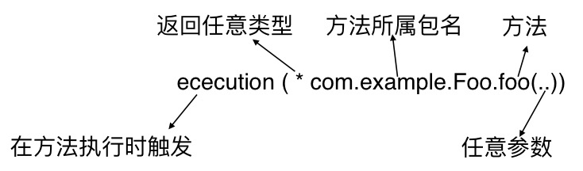
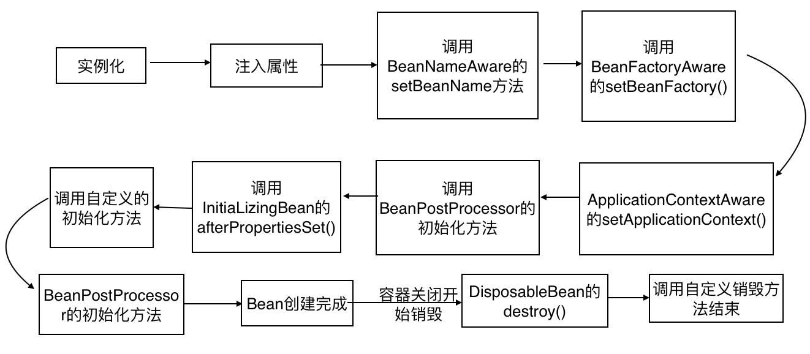

## spring-bean配置

spring三种主要装配配置：

- 在XML中进行显示配置
- 在Java中进行显示配置
- 隐式的bean发现机制和自动装配

@ComponentScan、Configuration、@Component

```xml
<context:component-scan></context:component-scan>
```

### 注解配置方式

用到的注解 @ComponentScan、Configuration、@Component

- @Configuration 注解表明此类是配置类，该类应该包含spring如何创建bean的细节。

  ```java
  //javaConfig中装配bean
  @ComponentScan
  @Configuration
  class Config{
      @Bean 
      public Foo foo(){
          return new Foo();
      }
  }
  ```

  

- @ComponentScan 扫描此注解下包和子包

  注解属性 basePackages ，basePackagesClasses 设置多个扫描包

  ​	 @ComponentScan(basePackages={"package1","package2"})

  ​	@ComponentScan(basePackagesClasses={Class1.class,Class2.class}) 两种方式

- @Component 

  告诉spring需要创建这个注解标注的类。

  @Component("name") 自定义bean的id 

  @Named("name") 自定义id（Java DI)

- @Autowired

  可以作用在构造器、setter方法还是其他的方法。Spring都会尝试满足方法参数上所申明的依赖。

  如果没有匹配的，那么会抛出异常。

  可以通过@Autowired(required=false) ，可以让这个bean处于未装配状态。


### xml配置方式

```xml
<?xml version="1.0" encoding="UTF-8"?>
<beans xmlns="http://www.springframework.org/schema/beans" xmlns:xsi="http://www.w3.org/2001/XMLSchema-instance" 
xmlns:c="http://www.springframework.org/schema/c"
xmlns:p="http://www.springframework.org/schema/p"
xmlns:p="http://www.springframework.org/schema/util"   
xsi:schemaLocation="http://www.springframework.org/schema/beans
                    http://www.springframework.org/schema/beans/spring-beans.xsd
                    http://www.springframework.org/schema/util
                    http://www.springframework.org/schema/spring-util.xsd
                    http://www.springframework.org/schema/context">
	<context:component-scan base-package="package1"/>
    
   <!--申明一个bean--> 
    <bean id="class1" class="Class1">
    	<constructor-arg ref="class2"/>
    </bean>
    
    <!--使用c命名空间来申明-->
    <bean id="class1" class="Class1" >
            <!--c为命名空间， argname表示构造函数属性名只， ref代表注入bean的引用-->
    	<c:argname-ref="class2"/>
        
    </bean>
    <!-- 参数索引配置，自有一个参数可以省略-->
    <bean id="class1" class="Class1" >
    	<c:_0-ref="class2"/>
    </bean>
     <bean id="class1" class="Class1" >
    	<c:_-ref="class2"/>
    </bean>
    
    <!-- 设置字面量 -->
    <bean id="class1" class="Class1">
    	<constructor-arg value="设置字面量"/>
    </bean>
    <bean id="class1" class="Class1" >
    	<c:_="设置字面量"/>
    </bean>
    
     <!-- 设置null参数 -->
    <bean id="class1" class="Class1">
        <constructor-arg ><null/></constructor-arg>
    </bean>
    <!-- 设置list参数 -->
    <bean id="class1" class="Class1">
        <constructor-arg >
        	<list>
            	<value>1</value>
                <value>2</value>
            </list>
        </constructor-arg>
    </bean> 
     <bean id="class1" class="Class1">
        <constructor-arg >
        	<list>
            	<ref bean="class1"/>
                <ref bean="class2"/>
            </list>
        </constructor-arg>
    </bean> 
    
     <!-- 设置属性 -->
    <bean id="class1" class="Class1">
       <property name="p1" ref="p1" />
    </bean> 
    <!-- p命名空间写法,用法和c一样 -->
  	<bean id="class1" class="Class1" 
          p:p1-ref="p1"></bean>
     <!--util命名空间 简化bean配置 -->
    <util:list id="list1">
    	<value>value1</value>
        <value>value20</value>
    </util:list>
    
</beans>
```

util-命名空间中的元素

| 元素               | 描述                                               |
| ------------------ | -------------------------------------------------- |
| util:constant      | 引用某个类型的public static 域，并将其暴露为bean   |
| util:list          | 创建一个List类型的bean                             |
| util:map           | 创建一个Map类型的bean，其中包含值或引用            |
| util:properties    | 创建一个java.util.Properties类型的bean             |
| util:property-path | 引用一个bean的属性（或内嵌属性），并将其暴露为bean |
| util:set           | 创建一个java.util.Set类型的bean，其中包含值或引用  |


### 混合配置

使用@Import 、@ImportResource

```java
@Configuration
@Import({Config1.class,Config2.class}) //导入javaconfig
@ImportResource("classpath:config.xml")
class Config{
}
```

xml中配置引用JavaConfig

```xml
<beans>
	<bean class='Config'/>
    <import resource='config.xml' />
</beans>
```


## profile配置

@Profile注解应用在类级别上，这个配置类中bean只有dev profile激活时才会创建。

```java
@Configuration
@Profile("dev")
class Config{
    @Bean(destroyMethod="shutdown")
    public DataSource dataSource(){
        return new EmbeddedDataBaseBuilder()
            .addScript("classpath:schema.sql")
            .addScript("classpath:test-data.sql")
            .build();
    }
    
    
}
```

spring3.2开始方法级别上使用@Profile

```java
@Configuration
class DataSourceConfig{
    @Bean(destoryMethod="shutdown")
    @Profile("dev")
    public DataSource embeddedDataSource(){
        return new EmbeddedDatabaseBuilder()
            .setType(EmbeddedDatabaseType.H2)
            .addScript("classpath:schema.sql")
            .addScript("classpath:test-data.sql")
            .build();
    }
    
    @Bean
    @Profile("prod")
    public DataSource jndiDataSource(){
        JndiObjecFactoryBean jndiObjectFactoryBean = new JndiObjectFactoryBean();
        jndiObjectFactoryBean.setJndiName("jdbc/myDS");
        jndiObjectFactoryBean.setResourceRef(true);
        jndiObjectFactoryBean.setProxyInterface(javax.sql.DataSource.class);
        return (DataSource) jndiObjectFactoryBean.getObject();
    }
}
```


### xml中配置profile

```xml
<beans profile="dev"> 、
    <!--使用嵌入式数据库-->
	<jdbc:embedded-database id="dataSource">
    	<jdbc:script location="classpath:schema.sql"/>
        <jdbc:script location="classpath:test-data.sql"/>
    </jdbc:embedded-database>
    
    <!--配置在bean标签中-->
    <bean profile="prod">
    	<jee:jndi-lookup id="dataSource"
                         jndi-name="jdbc/myDatabase"
                         resource-ref="true"
                         proxy-interface="javax.sql.DataSource"/>
    </bean>
    
</beans>
```

### 激活Profile

spring在确定哪个profile处于激活状态时，需要读取两个属性（spring.profiles.active、spring.profiles.default)。

如果设置了active就使用active的值，如果没有就取default。都没有那么只会创建那些没有定义在profile中的bean。

可以通过以下方式来设置：

- 作为DispatcherServlet的初始化参数；
- 作为Web应用的上下文参数；
- 作为JNDI条目；
- 作为环境变量；
- 作为jvm的系统属性
- 在继承测试类上，使用@ActiveProfiles注解设置。

在web应用中，设置spring.profiles.default的web.xml示例：

```xml
<?xml version="1.0" encoding="UTF-8" ?>
<web-app version="2.5">
	<context-param>
    	<param-name>contextConfigLocation</param-name>
        <param-value>/WEB-INF/spring/root-context.xml</param-value>
    </context-param>
	<context-param>
        <!--为上下文设置profile-->
    	<param-name>spring.profiles.default</param-name>
        <param-value>dev</param-value>
    </context-param>	
    <servlet>
    	<init-param>
             <!--为servlet设置默认profile-->
        	<param-name>spring.profiles.default</param-name>
            <param-value>dev</param-value>
        </init-param>
    </servlet>

</web-app>
```

### 条件化创建bean( @Conditional)

```java
public interface Condition{
    boolean matches(ConditionContext ctxt,AnnotatedTypeMetadata metadata);
}

public interface ConditionContext{
    BeanDefinitionRegistry getRegistry();
    ConfigurableListableBeanFactory getBeanFactory();
    Environment getEnvironmen();
    ResourceLoader getResourceLoader();
    ClassLoader getClassLoader();
}

public interface AnnotatedTypeMetadata{
    boolean isAnnotated(String annotationType);
    Map<String,Object> getAnnotationAttributes(String annotationType);
    Map<String,Object> getAnnotationAttributes(String annotationType,boolean calssValuesAsString);
    MultiValueMap<String,Object> getAllAnnotationAttributes(String annotationType);
    MultiValueMap<String,Object> getAllAnnotationAttributes(String annotationType,boolean classValuesAsString);
}
```

通过ConditionContext, 可以做到如下几点：

- getRegistry()返回的BeanDefinitionRegistry 检查bean的定义
- 借助getBeanFactory ()返回的ConfigurableListableBeanFactory检查Bean是否存在，甚至探查bean的属性
- 借助getEnvironmen() 返回的Environment检查环境变量是否存在以及它的值是什么
- 读取并探查getResourceLoader()返回的ResourceLoader所加载的资源；
- 借助getClassLoader()返回的ClassLoader加载并检查是否存在。

通过 AnnotatedTypeMetadata 的isAnnotated() 能够判断带有@Bean注解的方法是不是还有其他特定的注解，其他方法能检查注解方法上的其他注解属性。


### 处理自动装配的歧义性

当spring装配bean的时候，发现没有唯一、无歧义的可选值的时候。会抛出NoUniqueBeanDefinitionException

使用@Primary标记为首选，xml方式使用 <Bean primary='true' />

或使用@Qualifiter来限定范围，缩小到只有一个bean

@Qualifier注解所设置的参数就是想要注入的bean的id。

当一个Bean需要多个限定符来控制时，必须的创建自定义的限定符注解。java不允许同一个条目上重复出现相同的多个注解。

### bean的作用域

spring定义了多种作用域：

- 单例（singleton）：在整个应用中，只创建bean的一个实例。默认作用域。
- 原型（prototype）：每次注入或通过Spring应用上下文获取的时候，都会创建一个新的Bean实例。
- 会话（Session）：在Web应用中，为每个会话创建一个Bean实例。
- 请求（Rquest）：在Web应用中，为每个请求创建一个Bean实例。

```java
//两种方式
@Component
@Scope(ConfigurableBeanFactory.SCOPE_PROTOTYPE)
public class Foo{
  
  @Bean
  @Scope(ConfigurableBeanFactory.SCOPE_PROTOTYPE) 
  //@Scope("prototype)
  public Foo foo(){
    return new Foo();
  }
}

```

```xml
<bean id="foo" class="com.example.Foo" scope="prototype"/>
```

#### 使用会话和请求作用域

```java
@Component
@Scope(value=WebApplicationContext.SCOPE_SESSION,proxyMode=ScopedProxyMode.INTERFACES)
//bean是一个具体的类的话。 将使用ScopeProxyMode.TARGET_CLASS
public ShoppingCart cart(){}
```

```xml
<bean id="foo"
      class="com.example.Foo"
      scope="session">
  <!--可以将proxy-target-class属性设置为false，进而要求它生成基于接口的代理。默认为CGLib创建目标类的代理-->
	<aop:scoped-proxy proxy-target-class="false"  />
</bean>
```


proxyMode属性作用：

​	这个属性解决了会话或请求作用域bean注入到单例bean中遇到的问题。

因为注入单例bean时，会话域bean还不存在。知道有一个用户进入了系统，创建了会话之后，才会出现。

代理会将其进行懒解析并将调用委托给会话作用域内真正的bean。


### 运行时值注入 

#### 属性占位符

```java
@Configuration
@PropertySource("classpath:app.properties")
public class Config{
  @Autowired
  Environment env;
  @Bean
  public Foo foo(){
    return new Foo(env.getProperty("xxxx.xxx"))
  }
}

```

如果我们依赖于组件扫描和自动装配创建和初始化应用组件，那么久没有指定占位符的配置或类了。

这种情况下我们可以使用@Value注解

```java
public Foo(@Value("${prop.foo}") String foo){
  this.foo= foo;
}
```

为了使用占位符必须配置一个PropertyPalceholderConfigurer或 PropertySourcesPlaceholderConfigurer 。3.1开始推荐使用后者。

```xml
<context:property-placeholder/>
```

#### SpEL

SpEL的特性

- 使用bean的ID来引用bean；
- 调用方法和访问对象的属性
- 对值进行算术、关系和逻辑运算
- 正则表达式匹配
- 集合操作

SpEL表达式需要放在#{….}中

示例

```java
#(T(System).currentTimeMillis()) //t表达式将会将System视为java中的对应的类型
#{foo.prop}// 获取bean id 为foo中prop属性
#{systemProperties[JAVA_HOME]} //获取系统属性中的
```

spel运算符

| 运算符类型 | 运算符                                      |
| ---------- | ------------------------------------------- |
| 算术运算符 | +、- 、*、/、%、^                           |
| 比较运算符 | <、>、==、<= 、 >=、 lt、 gt、 eq、 le、 ge |
| 逻辑运算符 | and 、or、not、\|                           |
| 条件运算   | ?:(ternary) 、?:(Elvis)                     |
| 正则表达式 | matches                                     |


### 切面 AOP


spring提供了4种类型的AOP支持

- 基于代理的Spring aop
- 纯POJO切面
- @AspectJ注解驱动切面
- 注入式AspectJ切面（适用于Spring各版本）

spring只支持方法级别的连接点。

 

### 相关依赖

```xml
  <dependency>
            <groupId>org.springframework</groupId>
            <artifactId>spring-aop</artifactId>
        </dependency>
        <dependency>
            <groupId>org.springframework</groupId>
            <artifactId>spring-aspects</artifactId>
        </dependency>
        <dependency>
            <groupId>org.aspectj</groupId>
            <artifactId>aspectjrt</artifactId>
        </dependency>
```


#### 注解创建切面 

```java
@Aspect
public class Example{
  @Before("execution(* com.example.Foo.foo(..))")
  public void before(){} // foo方法调用之前
  @AfterReturning("execution(* com.example.Foo.foo(..))")
  public void after(){}//  foo方法调用之后
  @AfterThrowing("execution(* com.example.Foo.foo(..))")
  public void error(){}// foo方法调用出现异常时
}
```

| 注解            | 通知                                   |
| :-------------- | :------------------------------------- |
| @After          | 通知方法会在目标方法返回或者异常后调用 |
| @AfterReturning | 通知方法会在目标方法返回后调用         |
| @AfterThrowing  | 通知方法会在目标方法抛出异常后调用     |
| @Around         | 通知方法会将目标方法封装起来           |
| @Before         | 通知方法会在目标方法调用之前执行       |

通过@Pointcut注解声明频繁使用的切点表达式

````java
@Aspect
public class Example{
  @Pointcut("execution(* com.example.Foo.foo(..))")
  public void foo(){}
  @Before("foo()")
  public void before(){} // foo方法调用之前
  @AfterReturning("foo()")
  public void after(){}//  foo方法调用之后
  @AfterThrowing("foo()")
  public void error(){}// foo方法调用出现异常时
}
````

配置AspectJ自动代理

JavaConfig使用@EnableAspectJAutoProxy开启

#### 切面xml配置

| aop配置元素              | 用途                                                         |
| ------------------------ | ------------------------------------------------------------ |
| <aop: advisor>           | 定义aop通知器                                                |
| <aop: after>             | 定义aop后置通知 （不管被通知的方法是否执行成功）             |
| <aop: after-returning>   | 定义aop返回通知                                              |
| <aop: after-throwing>    | 定义aop异常通知                                              |
| <aop: around>            | 定义环绕通知                                                 |
| <aop: aspect>            | 定义一个切面                                                 |
| <aop: aspectj-autoproxy> | 启用@AspectJ注解驱动的切面                                   |
| <aop: before>            | 定义一个aop前置通知                                          |
| <aop: config>            | 顶层的aop配置元素。大多数的<aop: *>元素必须包含在<aop: config> 元素内 |
| <aop: declare-parents>   | 以透明的方式为被通知的对象引入额外的接口                     |
| <aop: pointcut>          | 定义一个切点                                                 |

```xml

  <aop:config>
        <aop:aspect ref="event">
            <aop:before
                    pointcut="execution(* com.example.aop.TestService.testxml(..))"
                    method="before"/>
            <aop:after-returning
                    pointcut="execution(* com.example.aop.TestService.testxml(..))"
                    method="after"/>
        </aop:aspect>
    </aop:config>

    <!--定义切点-->
    <aop:config>
        <!--定义切点再引用 简化-->
        <aop:pointcut id="testService" expression="execution(* com.example.aop.TestService.testxml(..))"/>

        <aop:aspect ref="event">
            <aop:before pointcut-ref="testService" method="before"/>
            <aop:after-returning pointcut-ref="testService" method="after"/>
        </aop:aspect>
    </aop:config>
 
```

xml方式配置开启aop自动代理

```xml
<aop:aspectj-autoproxy></aop:aspectj-autoproxy>
```

#### 环绕通知 和通知传递参数

java注解方式配置

```java
@Aspect
public class Example{
  @Pointcut("execution(** com.example.Foo.foo(...))")
  public void foo(){}
  @Pointcut("execution(* com.example.Foo.foo2(int) && args(num))")
  public void foo2(int num){}
  
  @Around("foo()")
  public void aroundFoo(ProceedingJoinPoint jp){
    try{
        System.out.println("before");
    		jp.proceed();
   			System.out.println("after");
    }catch(Throwable e){
      System.out.println("AfterThrowing");
    }
  }
  
  @Before("foo(num)")
  public void foo2(int num){
  }  
}
```

xml方式配置参数

```xml

<aop:config>
	<aop:aspect ref="example">
  	<aop:pointcut id="foo" expression="execution(** com.example.Foo.foo(**))"/>
    <aop:pointcut id="foo2" expression="execution(* com.example.Foo.foo2(int) and args(num))"
  	<aop:around pointcut-ref="foo" method="aroudnFoo"/>
    <aop:before pointcut-ref="foo2" method="foo2" />
  </aop:aspect>
</aop:config>
```


#### 通过切面引入新的功能

```java
@Aspect
public class Example{
  @DeclareParents(value="com.example.Foo+",defaultImpl=DefaultBar.class)
  public static Bar bar;
}
```

@DeclareParents注解各部分含义：

- value属性指定了哪种类型的bean要引入该接口。（+表示式Foo的所有子类型，非本身）
- defaultImpl属性指定了为引入功能提供实现的类。
- @DeclareParents注解所标注的静态属性指明了要引入的接口。

xml方式

```xml
<aop:aspect>
	<aop:declare-parents types-matching="com.example.Foo+" 
                       implement-interface="com.example.Bar"
                       default-impl="com.example.DefaultBar"
                       
    />
  <!-- 可使用delegate-ref="defaultBar"替代default-impl-->
</aop:aspect>

```

> delegate-ref引用spring bean作为引入的委托，default-impl直接表示委托


### AspectJ切面


### 常用上下文

- AnnotationConfigApplicationContext:从一个或多个基于java的配置类中加载Spring应用上下文。

- AnnotationConfigWebApplicationContext: 从一个或多个基于Java的配置类中加载Spring web应用上下文。

- ClassPathXmlApplicationContext:从类路径下的一个或多个XML配置文件中加载上下文定义，把应用上下文的定义文件做为类资源。

  ```java
  ApplicationContext context = new ClassPathXmlApplicationContext("test.xml"); //类路径下查找
  ```

  

- FileSystemXmlApplicationContext : 从文件系统下的一个或多个XML配置文件中加载上下文定义。
  ```java
  ApplicationContext context = new FileSystemXmlApplicationContext("/Users/test/test.xml");//文件系统下查找
  ```
- XmlWebApplicationContext: 从Web应用下的一个或多个XML配置文件中加载上下文定义。


### bean的生命周期



1. Spring对bean进行示例化
2. Spring将值和bean的引用注入到bean对应的属性中；
3. 如果bean实现了BeanNameAware接口，Spring将Bean的ID传给setBeanName()
4. 如果实现了BeanFacotryAware接口，Spring将调用setBeanFacotry(),将BeanFactory容器示例传入
5. 如果bean实现了ApplicationContextAware接口，Spring将调用setApplicationContext(),将bean所在的应用上下文的引用传入进来。
6. 如果Bean实现了BeanPostProcessor接口，Spring将调用他们的postProcessBeforeInitialization()
7. 如果bean实现了InitializingBean接口，Spring将调用他们的afterPropertiesSet(). 如果使用了initMethod声明初始化方法，该方法也会调用
8. 如果实现了BEanPostProcessor接口，Spring将调用postProcessAfterInitialization
9. bean初始化完毕，将驻留在上下文中。直到上下文销毁
10. 如果bean实现了DisposableBean接口，Spring将调用destroy接口方法。如果bean使用了destroyMethod声明销毁方法，该方法也会被调用


### todo Instrumentation   sping web service 	Integration	Batch		

