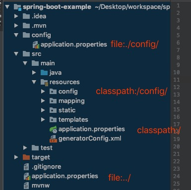

# springboot

## springboot hello world


### 自动配置过程

```java

@SpringBootConfiguration
@EnableAutoConfiguration //开始自动配置
@ComponentScan(excludeFilters = {
		@Filter(type = FilterType.CUSTOM, classes = TypeExcludeFilter.class),
		@Filter(type = FilterType.CUSTOM, classes = AutoConfigurationExcludeFilter.class) })
public @interface SpringBootApplication {
}

@AutoConfigurationPackage
@Import(AutoConfigurationImportSelector.class) //
public @interface EnableAutoConfiguration {}

/
 * @see EnableAutoConfiguration
 */
public class AutoConfigurationImportSelector
		implements DeferredImportSelector, BeanClassLoaderAware, ResourceLoaderAware,
		BeanFactoryAware, EnvironmentAware, Ordered {
@Override
	public String[] selectImports(AnnotationMetadata annotationMetadata) {
		if (!isEnabled(annotationMetadata)) {
			return NO_IMPORTS;
		}
		AutoConfigurationMetadata autoConfigurationMetadata = AutoConfigurationMetadataLoader
				.loadMetadata(this.beanClassLoader);
		AnnotationAttributes attributes = getAttributes(annotationMetadata);
		List<String> configurations = getCandidateConfigurations(annotationMetadata,
				attributes);
		configurations = removeDuplicates(configurations);
		Set<String> exclusions = getExclusions(annotationMetadata, attributes);
		checkExcludedClasses(configurations, exclusions);
		configurations.removeAll(exclusions);
		configurations = filter(configurations, autoConfigurationMetadata);
		fireAutoConfigurationImportEvents(configurations, exclusions);
		return StringUtils.toStringArray(configurations);
	}
            
            
     protected List<String> getCandidateConfigurations(AnnotationMetadata metadata,
			AnnotationAttributes attributes) {
		List<String> configurations = SpringFactoriesLoader.loadFactoryNames(
				getSpringFactoriesLoaderFactoryClass(), getBeanClassLoader());
		Assert.notEmpty(configurations,
				"No auto configuration classes found in META-INF/spring.factories. If you "
						+ "are using a custom packaging, make sure that file is correct.");
		return configurations;
	}
}
// 从这个路径下获取到 EnableAutoConfiguration 属性的值
public abstract class SpringFactoriesLoader {
	public static final String FACTORIES_RESOURCE_LOCATION = "META-INF/spring.factories";
}
```

> 可以启用debug属性，来显示自动配置信息日志。

##### @Conditional派生注解（Spring注解版原生的@Conditional作用）

作用：必须是@Conditional指定的条件成立，才给容器中添加组件，配置配里面的所有内容才生效；

| @Conditional扩展注解            | 作用（判断是否满足当前指定条件）                 |
| ------------------------------- | ------------------------------------------------ |
| @ConditionalOnJava              | 系统的java版本是否符合要求                       |
| @ConditionalOnBean              | 容器中存在指定Bean；                             |
| @ConditionalOnMissingBean       | 容器中不存在指定Bean；                           |
| @ConditionalOnExpression        | 满足SpEL表达式指定                               |
| @ConditionalOnClass             | 系统中有指定的类                                 |
| @ConditionalOnMissingClass      | 系统中没有指定的类                               |
| @ConditionalOnSingleCandidate   | 容器中只有一个指定的Bean，或者这个Bean是首选Bean |
| @ConditionalOnProperty          | 系统中指定的属性是否有指定的值                   |
| @ConditionalOnResource          | 类路径下是否存在指定资源文件                     |
| @ConditionalOnWebApplication    | 当前是web环境                                    |
| @ConditionalOnNotWebApplication | 当前不是web环境                                  |
| @ConditionalOnJndi              | JNDI存在指定项                                   |


## 配置文件

### 打包完内部配置文件加载顺序

file:/.config/  ->  file../  -> classpath:/config/ -> classpath:/



可以通过spring.config.location指定使用某一个配置文件(打包后指定)  

```shell
java -jar springboot.jar --spring.config.location=config.path
```

### 外部配置文件加载顺序

1. 命令行

   ```shell
   java -jar springboot.jar --server.port=8088 -server.context-path=/example
   ```

2. 来自java:comp/env的JNDI属性

3. java系统属性（system.getProperties())

4. 操作系统环境变量

5. RandomValuePropertySource配置的radmom.*属性值

6. jar包外部的application.yml/application.properties（带spring.profile)配置文件的

7. jar包内部带spring.profile配置文件

8. jar包外部不带spring.profile配置文件

9. jar包内部不带spring.profile配置文件

10. @Configuration注解类上的@PropertySource

11. 通过SpringApplication.setDefaultProperties指定的默认属性

> 以上按照优先级从高到低的顺序，所有位置的文件都会被加载，高优先级的会覆盖低优先级。最终组合互补。

### yaml语法

#### 基本语法 

k:(空格) v   表示一对键值对，空格必须有；并且属性和值大小写敏感

```
server: 
	port: 8080
```

#### 值的写法

字面量直接写

字符串默认不加上单引号、双引号；

**单引号和双引号区别**

> 双引号：不会转义字符串里的特殊字符 
>
> 单引号：会转义特殊字符 （原样输出）

#### 对象、map 

```yaml
user :
	name: 张三
	age: 18
# 行内写法
user2 : {name: 张三,age: 18} 
```

#### 数组

```yaml
names: 
	- 张三
	- 李四
# 行内写法
names: [张三,李四]
```

##### 配置文件占位符

```yaml
person: 
	id: ${random.uuid}
	age: ${random.int}
```

##### 多文档块方式

```yml
#激活指定profile
spring:
	active: dev
---
server: 
	port: 8081
spring:
	profiles: dev
---
server: 
	port: 8082
spring:
	profiles: prod
```


##### @Value和ConfigurationProperties比较

|      | @Value               | @ConfigurationProperties |
| ---- | -------------------- | ------------------------ |
| 功能 | 批量注入配置文件属性 | 单个                     |
| 松散语法|支持|不支持|
| SpEL |支持|不支持|
| JSR303数据校验 |支持|不支持|
| 复杂类型封装 |支持|不支持|


## springboot日志

---

### 日志适配统一

springboot使用 slf4j + logback的方式记录日志

将项目中其他的日志框架排除。

用中间包替换原有的日志框架（log4j-to-slf4j,jul-to-slf4j）

导入slf4j其他实现框架

slf4j+log4j实现方式

```xml
<dependency>
  <groupId>org.springframework.boot</groupId>
  <artifactId>spring-boot-starter-web</artifactId>
  <exclusions>
    <exclusion>
      <artifactId>logback-classic</artifactId>
      <groupId>ch.qos.logback</groupId>
    </exclusion>
    <exclusion>
      <artifactId>log4j-over-slf4j</artifactId>
      <groupId>org.slf4j</groupId>
    </exclusion>
  </exclusions>
</dependency>

<dependency>
  <groupId>org.slf4j</groupId>
  <artifactId>slf4j-log4j12</artifactId>
</dependency>
```


### 日志配置

 ```properties
# 默认info 。 trace debug info warn error
loggin.level.com.example=trace
#loggin.file和loggin.path属性相斥。优先loggin.file
#loggin.file可以设置完整路径
loggin.path=/applog/log

#日志输出格式
# %d表示日期 
# %thread表示线程名
# %-5level 日志级别从左显示5个字符宽度
# %logger{50} 表示logger名字最长50个字符。一般为类名
# %msg 输出的日志消息
# %n 换行
# 控制台输出格式
loggin.pattern.console=%d{yyyy-MM-dd HH:mm:ss.SSS} [%thread] %-5level %logger{50} %msg%n
# 文件中输出的格式
loggin.pattern.file
 


 ```


类路径下放上配置文件，springboot将不使用默认配置

| Logging System          | Customization                            |
| ----------------------- | ---------------------------------------- |
| Logback                 | `logback-spring.xml`, `logback-spring.groovy`, `logback.xml` or `logback.groovy` |
| Log4j2                  | `log4j2-spring.xml` or `log4j2.xml`      |
| JDK (Java Util Logging) | `logging.properties`                     |

不加-spring的方式有日志框架识别。

加上后由spring框架解析。可使用springProfile等功能

## web

### springboot静态资源映射

1. webjars

2. /** 方式  以下路径找

   ```
   classpath:/META-INF/resources/
   classpath:/resources/
   classpath:/static/
   classpath:/public/
   / (项目跟路径)
   ```

3. 欢迎页。静态资源路径中的index.html

4. 图标配置
   **/favicon.ico 静态资源文件夹中找

### 路径配置

```java
@ConfigurationProperties(prefix = "spring.resources", ignoreUnknownFields = false)
public class ResourceProperties {
	private static final String[] CLASSPATH_RESOURCE_LOCATIONS = {
			"classpath:/META-INF/resources/", "classpath:/resources/",
			"classpath:/static/", "classpath:/public/" };
}
```

### 自动配置

@EnableWebMvc 启动自己的配置。springboot自动配置失效


### Thymeleaf

#### 自动配置文件类

```java
//默认在templates下 以.html结尾
@ConfigurationProperties(prefix = "spring.thymeleaf")
public class ThymeleafProperties {
	private static final Charset DEFAULT_ENCODING = StandardCharsets.UTF_8;
	public static final String DEFAULT_PREFIX = "classpath:/templates/";
	public static final String DEFAULT_SUFFIX = ".html";
}
```

#### 命名空间

```xml
<html lang="en" xmlns:th="http://www.thymeleaf.org">
```

#### 常用属性

##### text、utext

th:text 转义特殊字符, th:utext不转义特殊字符

##### insert 、replace、 include、fragment 用法

```html
<!--抽取公共片段-->
<footer id='footer' th:fragment="copy">
  &copy; 2011 The Good Thymes Virtual Grocery
</footer>
…included three times in host <div> tags, like this:
<body>

<!--
	引入公共片段
	格式：
		~{templatename::selector}  模板名::css选择器   
			<div th:insert="footer::#footer"></div>
		~{templatename:fragment} 模板名::片段名
			<div th:insert="footer :: copy"></div>
	th:insert:将公共片段整个插入到指定元素中
	th:replace:替换指定元素
	th:include: 将片段中的内容引入进指定标签 
	使用th:insert等属性时可以省略~{}，但是行内写法必须加上[(~{templatename:fragment})]
-->
<body>
  <div th:insert="footer :: copy"></div>

  <div th:replace="footer :: copy"></div>

  <div th:include="footer :: copy"></div>
</body>

 <!--生成结果-->
 <body>
      <div>
        <footer>
          &copy; 2011 The Good Thymes Virtual Grocery
        </footer>
      </div>

      <footer>
        &copy; 2011 The Good Thymes Virtual Grocery
      </footer>

      <div>
        &copy; 2011 The Good Thymes Virtual Grocery
      </div>
</body>

```

##### 遍历

``` xml
<tr th:each="prod,iterStat : ${prods}" th:class="${iterStat.odd}? 'odd'">
    <td th:text="${prod.name}">Onions</td>
    <td th:text="${prod.price}">2.41</td>
    <td th:text="${prod.inStock}? #{true} : #{false}">yes</td>
  </tr>
</table>
```

##### 条件判断

```xml
<td th:text="${prod.inStock}? #{true} : #{false}"> 
<a href="comments.html"
   th:href="@{/comments(prodId=${prod.id})}" 
   th:unless="${#lists.isEmpty(prod.comments)}">view</a>

 <div th:switch="${user.role}">
  <p th:case="'admin'">User is an administrator</p>
  <p th:case="#{roles.manager}">User is a manager</p>
  <p th:case="*">User is some other thing</p>
</div>
```

##### with

```xml
<div th:with="firstPer=${persons[0]}">
  <p>
    The name of the first person is <span th:text="${firstPer.name}">Julius Caesar</span>.
  </p>
</div>
```


##### th:任意属性 修改默认值


##### 表达式

```
  基本表达式
    获取变量: ${...}
    选择表达式: *{...}
    获取国际化内容: #{...}
    定义url: @{...}
    片段表示式: ~{...}
Literals
    Text literals: 'one text', 'Another one!',…
    Number literals: 0, 34, 3.0, 12.3,…
    Boolean literals: true, false
    Null literal: null
    Literal tokens: one, sometext, main,…
Text operations:
    String concatenation: +
    Literal substitutions: |The name is ${name}|
Arithmetic operations:
    Binary operators: +, -, *, /, %
    Minus sign (unary operator): -
Boolean operations:
    Binary operators: and, or
    Boolean negation (unary operator): !, not
Comparisons and equality:
    Comparators: >, <, >=, <= (gt, lt, ge, le)
    Equality operators: ==, != (eq, ne)
Conditional operators:
    If-then: (if) ? (then)
    If-then-else: (if) ? (then) : (else)
    Default: (value) ?: (defaultvalue)
Special tokens:
	No-Operation: _
```


##### 内置对象

```
#ctx: the context object.
#vars: the context variables.
#locale: the context locale.
#request: (only in Web Contexts) the HttpServletRequest object.
#response: (only in Web Contexts) the HttpServletResponse object.
#session: (only in Web Contexts) the HttpSession object.
#servletContext: (only in Web Contexts) the ServletCon“#ctx: the context object.
#vars: the context variables.
#locale: the context locale.
#request: (only in Web Contexts) the HttpServletRequest object.
#response: (only in Web Contexts) the HttpServletResponse object.
#session: (only in Web Contexts) the HttpSession object.
#servletContext: (only in Web Contexts) the ServletContext Object.
#execInfo: information about the template being processed.
#messages: methods for obtaining externalized messages inside variables expressions, in the same way as they would be obtained using #{…} syntax.
#uris: methods for escaping parts of URLs/URIs
#conversions: methods for executing the configured conversion service (if any).
#dates: methods for java.util.Date objects: formatting, component extraction, etc.
#calendars: analogous to #dates, but for java.util.Calendar objects.
#numbers: methods for formatting numeric objects.
#strings: methods for String objects: contains, startsWith, prepending/appending, etc.
#objects: methods for objects in general.
#bools: methods for boolean evaluation.
#arrays: methods for arrays.
#lists: methods for lists.
#sets: methods for sets.
#maps: methods for maps.
#aggregates: methods for creating aggregates on arrays or collections.
#ids: methods for dealing with id attributes that might be repeated (for example, as a result of an iteration).

```


##### 引入片段时传入参数

```xml
<div th:replace="footer::#footer(activeUri='main')"></div>
```

## 国际化

springboot默认配置项目路径下messages 开头的文件

spring.messages.basename可以修改默认路径

适配时只需文件名带上编号就能自动适配

messages_en_US.properties 

messages_zh_CN.properties

## 拦截器


HandlerInterceptor

## 错误页面处理


### 

